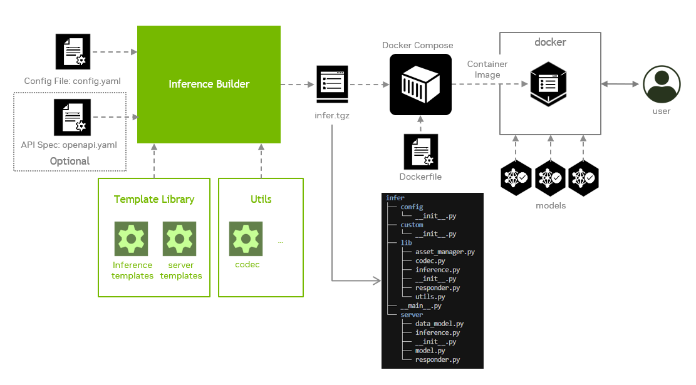
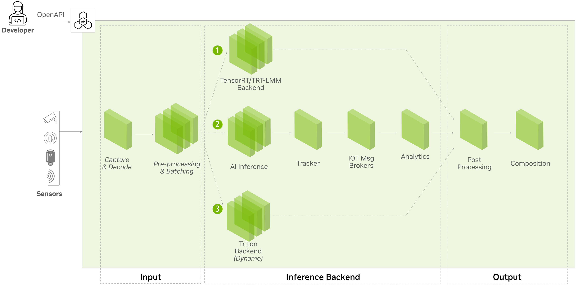

# Inference Builder

## Overview

Inference Builder is a tool that automatically generates inference pipelines and integrates them into either a microservice or a standalone application. It takes an inference configuration file and an OpenAPI specification (when integrated with an HTTP server) as inputs, and may also require custom code snippets in certain cases.

The output of the tool is a Python package that can be used to build a microservice container image with a customized Dockerfile.



The Inference Builder consists of three major components:

- Code templates: These are reusable modules for various inference backends and frameworks, as well as for API servers. They are optimized and tested, making them suitable for any model with specified inputs, outputs, and configuration parameters.
- Common inference flow: It serves as the core logic that standardizes the end-to-end inference process—including data loading and pre-processing, model inference, post-processing, and integration with the API server. It supports pluggable inference backends and frameworks, enabling flexibility and performance optimization.
- Command line tool: It generates a source code package by combining predefined code templates with the Common Inference Flow. It also automatically produces corresponding test cases and evaluation scripts to support validation and performance assessment.

Visit our [documentation](doc) for more details:

- [Inference Builder Usage](doc/usage.md)
- [Inference Builder Architecture](doc/architecture.md)

## Getting started

First, be sure your system meets the requirement.

| Operating System   | Python | CPU            |  GPU*                        |
|:-------------------|:-------|:---------------|:-----------------------------|
|Ubuntu 24.04        |3.12    | x86, aarch64   |Nvidia ADA, Hopper, Blackwell |

*: If you only generate the inference pipeline without running it, no GPU is required.

Next, follow these steps to get started:

### Install prerequisites

```bash
sudo apt update
sudo apt install protobuf-compiler
sudo apt install python3.12-venv python3.12-dev
```

**Note for TEGRA users:** If you're using a TEGRA device, you'll also need to install the Docker buildx plugin:

```bash
sudo apt install docker-buildx
```

### Clone the repository and set up the virtual environment

```bash
git clone https://github.com/NVIDIA-AI-IOT/inference_builder
cd inference_builder
git submodule update --init --recursive
python -m venv .venv
source .venv/bin/activate
pip3 install -r requirements.txt
```

## Play with the examples

Now you can try [our examples](builder/samples/README.md) to learn more. These examples span all supported backends and demonstrate their distinct inference flows.



## Benefit of using Inference Builder

Compared to manually crafting inference source code, Inference Builder offers developers the following advantages:
- Separation of concerns: Introduces a new programming paradigm that decouples inference data flow and server logic from the model implementation, allowing developers to focus solely on model behavior.
- Backend flexibility: Standardizes data flow across different inference backends, enabling developers to switch to the optimal backend for their specific requirement without rewriting the entire pipeline.
- Hardware acceleration: Automatically enables GPU-accelerated processing to boost performance.
- Streaming support: Provides built-in support for streaming protocols such as RTSP with minimal configuration.
- Standardized testing: Automates and standardizes test case generation to simplify validation and evaluation workflows.

## Contributing

Contributions are welcome! Please feel free to submit a PR.


## Project status and roadmap

The project is under active development and the following features are expected to be supported in the near future:

- Support for more backends and frameworks such as VLLM and onnx runtime.
- Support for more model types such as speech models.
