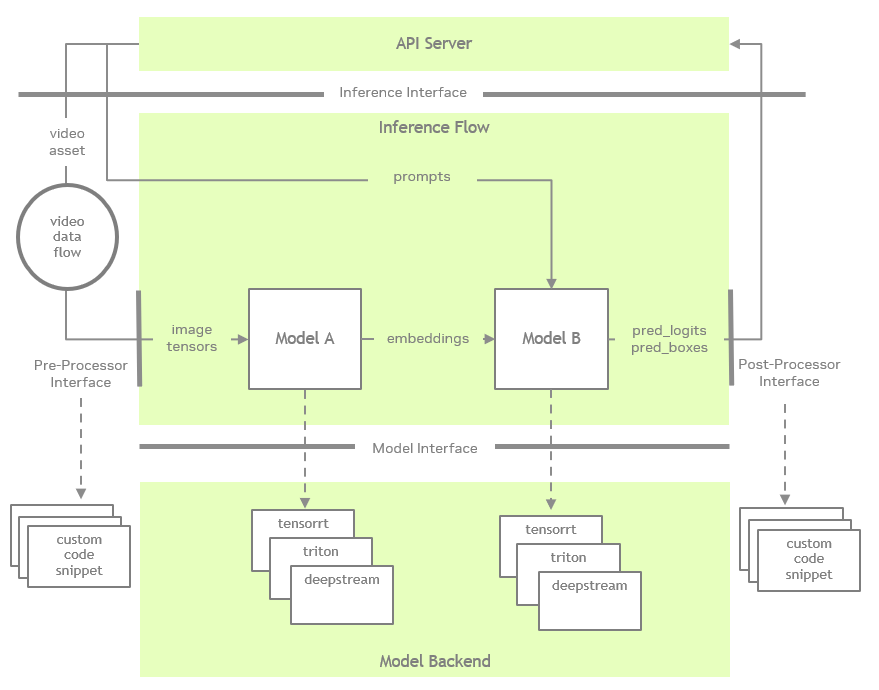

## Architecture

Inference Builder generates the Python package that includes both the inference logic and server integration. The package is constructed from a standardized inference flow combined with a variety of well tested source code templates—including server templates and inference templates.

The generated code follows the architecture illustrated in the diagram below.

### Inference Flow

The inference flow is standardized by the base class `InferenceBase`, which supports inference through multiple models. Each model is managed by a `ModelOperator` instance, and is connected with one another through data flows. Each data flow is managed by various implementations of `DataFlow`, handling various types of data, such as images, videos, speech, etc.
The inference flow is standardized by the base class `InferenceBase`, which supports execution of inference across multiple models. Each model is managed by a dedicated `ModelOperator` instance, and models are connected through well-defined data flows. The output data from one model is passed to other models through data flows, using Python dictionaries that map names to tensors. This allows each model to receive its required inputs in a structured and consistent format.

### Inference Backend

The inference backend can vary depending on the model type, user requirements, and hardware platform. To support a wide range of SDKs and frameworks, Inference Builder defines a standard interface: 'ModelBackend'. This interface allows the ModelOperator to interact with models regardless of their underlying implementation.

### API Server

The API server handles incoming requests from end users and returns responses. It supports communication protocols such as HTTP and gRPC, and conforms to standards like OpenAPI specifications or Protocol Buffers (protobuf) definitions.

Multiple server implementations are supported, provided they comply with the API specification and interact with the inference pipeline through a defined abstract interface.

Additionally, Inference Builder supports a server type called `serverless`, which enables users to run inference as a standalone command-line interface without deploying a server.

The interactions among the components described above are illustrated in the diagram below:

### Integration with Customized Code

Custom logic can be integrated into the inference flow through the Processor Interface. In the inference configuration file, multiple named pre-processors and post-processors can be assigned to each `ModelOperator` instance. Corresponding Python code snippets implementing these processors must be provided prior to code generation.

When custom processors are configured, the `ModelOperator` sequentially passes named tensors from the input data flow through the assigned pre-processors before invoking the model backend. Similarly, after receiving output tensors from the backend, the `ModelOperator` passes them through the configured post-processors in sequence.

Users can define a processor in the configuration file in a way similar to declaring a function interface—by specifying input names and return value names in order. Additionally, a configuration map can be provided to pass parameters that customize the processor’s behavior.